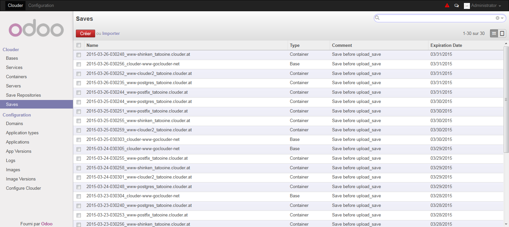
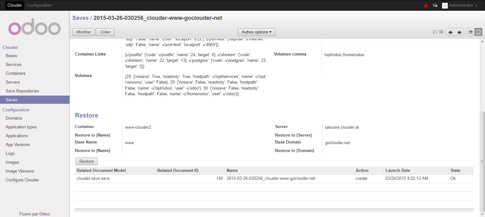
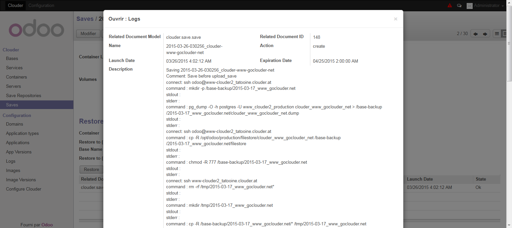
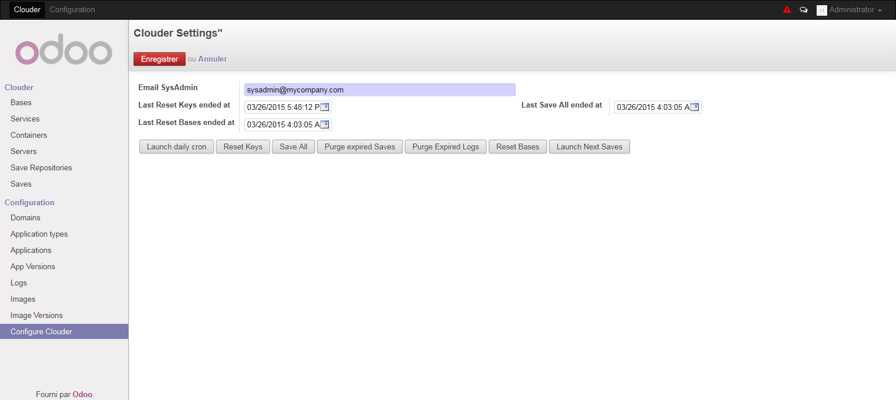

=========================
Backups and Configuration
=========================

Backups
=======

Clouder take care of the backup management and will periodically launch a backup on containers and bases.

Two methods are today available for the backups :
Simple, will simply copy the files in a directory of the backup container.
Bup, will store the backup into a bup repository. Bup is a backup solution based on git which will do global deduplication on the backup to massively save disk space. With bup, you can make hourly backup without having to worry about disk space.
Among the downside it’s difficult to remove a backup once on bup, that’s why we sometimes change the repository where backup are stored, and we need to manage the concept of repository on Clouder.

You can see the list of all backup on the Save menu.

Each backup container contains :
- His name
- The Backup container where it is stored.
- His repository.
- The reason for the backup.
- The date.
- The date when the backup will be deleted.

All backups are linked to the container/service/base from which it was generated, but also most of the informations from container/service/base are stored into the save form because we need them if we need to regenerate them because the object was deleted.

To restore a backup, you simply can press the button restore, after having change the Restore to fields if you want to restore in another container of base. If not, it will delete the current container/base (after another backup).

The restore will :
- If container, it will delete the content of the volumes and restore them from the backup.
- If base, if will drop the database and restore it
- Some specific files may be restored if specified in the python code of the template modules.

You can check the save and restore commands execution on the log window.

Configuration
=============

On the Configure Clouder menu you’ll find some buttons to execute maintenance tasks :
- Reset keys will reset the keys of all containers managed by Clouder.

- Save All will perform some maintenance task on the backup containers (if they use Bup), will launch a save on all containers and bases, and upload a copy of the backup containers to their backup-upload links.

- Purge expired saves will drop all saves which pass their expiration date.

- Purge expired logs will drop all logs which pass their expiration date.

- Reset bases will launch the reset action on the bases which have the Reset each day checkbox set to True.

- Launch daily cron will execute all the above task, and is linked to a daily cron.

- Launch next save will execute a backup on all containers/bases which pass the next save date. It’s linked to a cron which is executed every thirty minutes.

Reset keys, Save All and Reset bases, the longest tasks, will update the configuration dates when they end their actions, so you can easily know at which time the actions finished.

You also have to indicate in the configuration the sysadmin email. It’s a requirement, you can’t use Clouder with this field empty.
