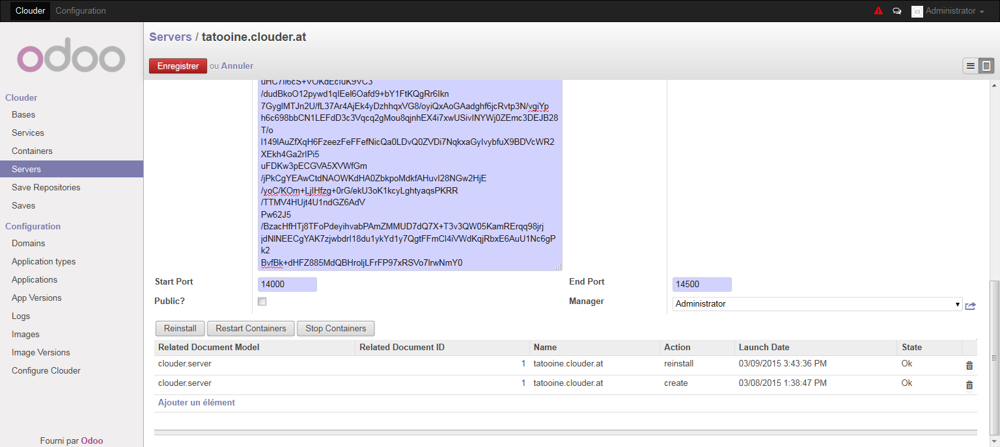
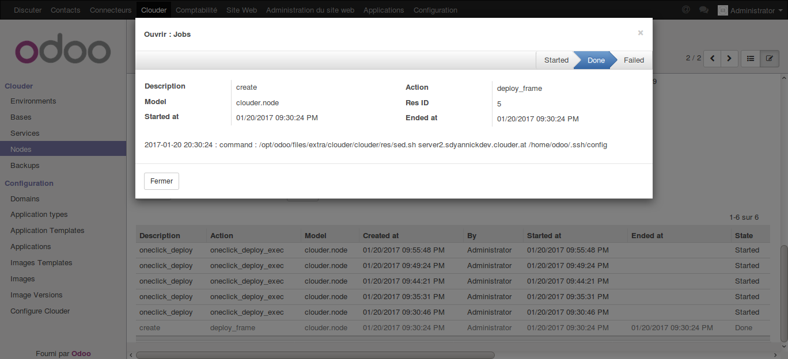

=======================
Connect to a new server
=======================

We will see in this chapter how we can configure the servers and connect them to your Clouder. Clouder is only compatible with Linux, and the Debian distribution is recommended.

First, if it's not already done, you shall install openssh on your server and Docker.
In Debian, you just have to execute these commands :
For ssh :
apt-get install openssh-server

For Docker :
echo deb http://get.docker.io/ubuntu docker main | sudo tee /etc/apt/sources.list.d/docker.list
sudo apt-key adv --keyserver keyserver.ubuntu.com --recv-keys 36A1D7869245C8950F966E92D8576A8BA88D21E9
sudo apt-get update
sudo apt-get install -y lxc-docker

Then, you need to add the public key of your clouder in the /root/.ssh/authorized_keys file, so Clouder can connect to the server. Root rights are needed for the docker commands.
If you don't have a public key or don't know how to create one, a public key will be automatically generated when you register the server in your Clouder.

And that's it. Now we can go to the Server menu in Clouder and create a new record.

Here the fields needed :
- The server domain name used to contact the server. You can only use here lowercase, digit, hyphen and dot.

- The server IP. You can only use here digit and dot.

- The ssh port to connect to the server.

- The supervision container which will monitor the server, if needed. The server will be added in the supervisor during the creation of the record.

- The SSH private and public key to connect to the server. A couple of keys are automatically generated when you create a new record, but you can use your owns.

- The ports range for the containers which will be created in this server. When you create a container without specifying an hostport, a new port from this range will be attributed to it.

- Check the public checkbox if you want all users of the Clouder to be able to use this server. Otherwise, a user can only access a server if he is the manager of this server (or an administrator).

When you save the new record, the ssh key will be saved in the system hosting the Clouder so it can connect to the new server, and if needed a new configuration file will be added to the supervision server. You can check the result of the command in the logs.

Finally, you can use the reinstall button if you think the ssh key wasn't correctly installed, or use restart/stop containers to restart/stop all containers in a server in one click.
