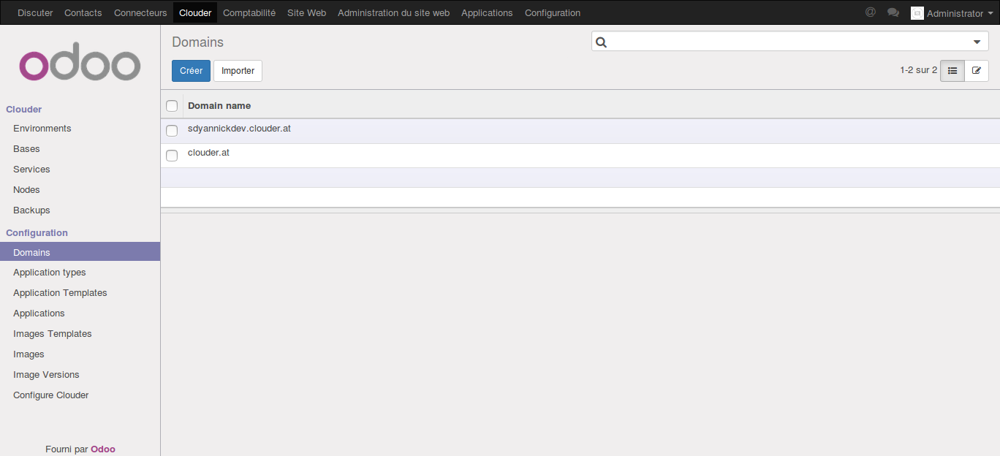
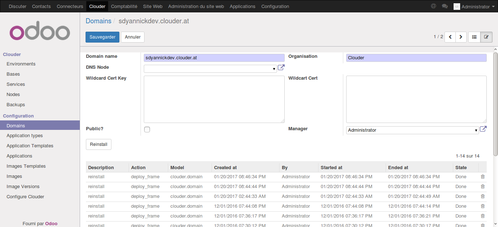
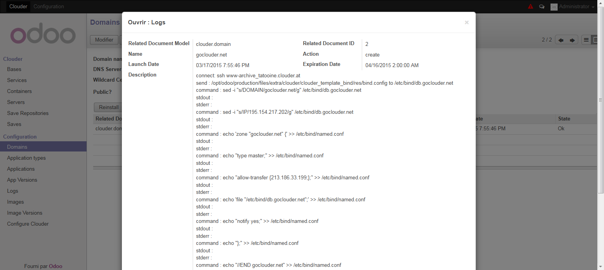
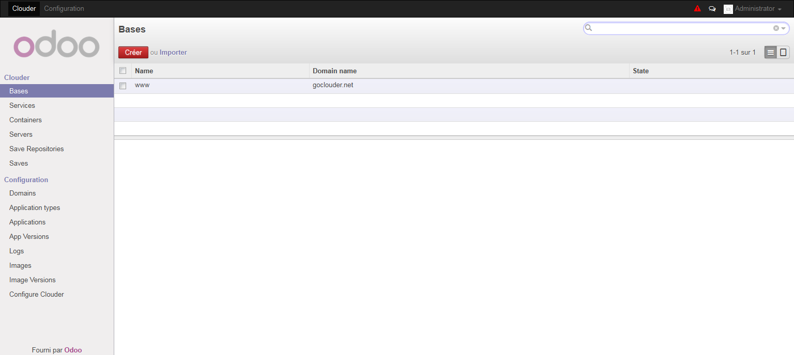
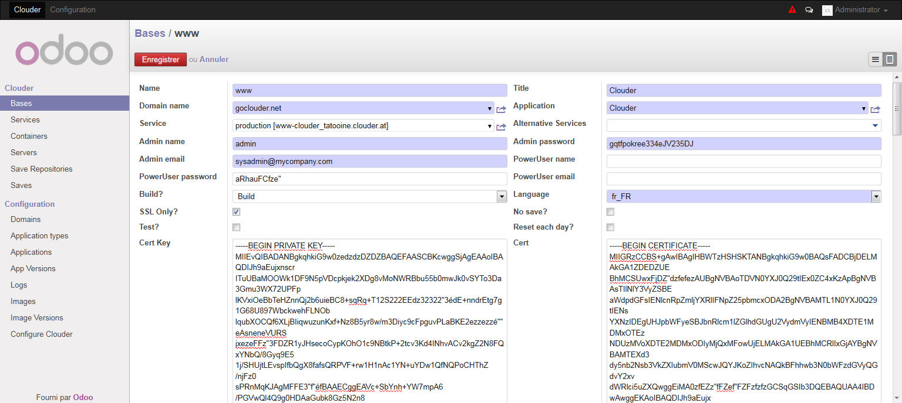
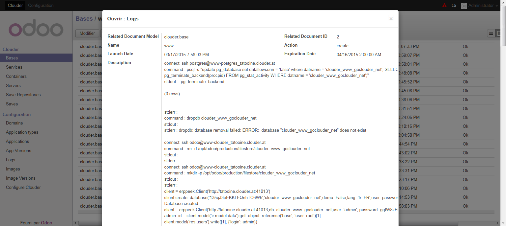
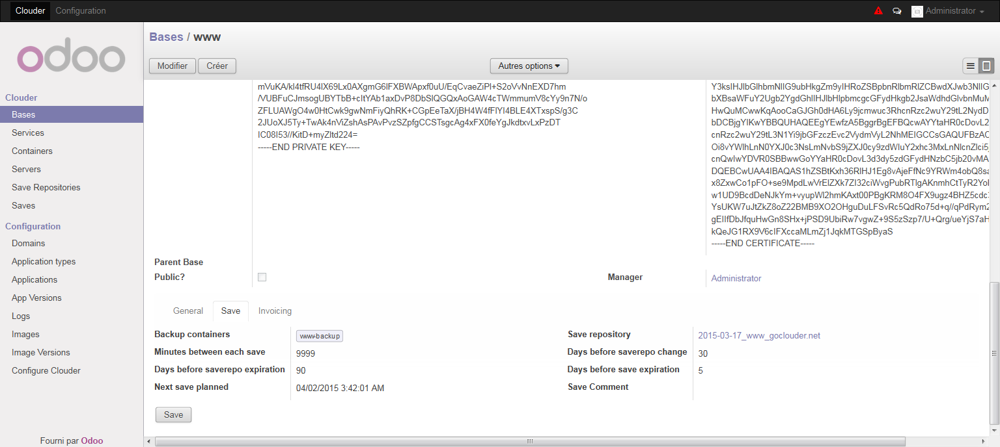

Domains and Bases
=================

Domains
-------

In the Domain menu you can manage the domain managed by your Clouder.

In the domain form, you have to specify :
- The domain, only lowercase, digit, hyphen and dot. are accepted.

- The organization managing the domain.

- The DNS container which will manage the domain.

- If you have one, a wildcard ssl certificate which you’ll be able to use for all subdomains.

- Check the public checkbox if you want all users of the Clouder to be able to use this domain. Otherwise, a user can only access a domain if he is the manager of this domain (or an administrator).

When you save the new record, a configuration file will be installed in the DNS server to manage the domain. You can check the result of the command in the logs

You can use the reinstall button if you think the domain has not be correctly installed.

Bases
-----

A base correspond to an url which will be available on the Internet, and often correspond to a database.

The important fields are :
- The base name. You can only use here lowercase, digit and hyphen.

- The base title. The application will be configured with this title.

- The domain to use. The application will be available at the url BASENAME.DOMAIN

- The application of the base. When you select it, some fields like the admin name/email, links and options will be inherited.

- The service which will manage the base. If not filled, a new container and a new service will automatically be created.

- If you need load balancing for this base, you can configure some alternative services (not working yet).

- You can specify the login/password/email for the admin account. The password will be automatically generated.

- Same for the poweruser login/password/email. A poweruser account is used if we don’t want to give admin access to the user who requested the creation of the base.

- The type of installation which shall be made. Build will make a full installation of the application, while restore (not yet working) will restore and configure a dump file.

- The default language which shall be configured in the application.

- You can use the ssl only checkbox if you want the url to be only accessible through ssl. All users will be redirected on the SSL port of the proxy.

- You can use the no save checkbox if you don’t want to auto backup this base, because it’s a test base for example. Note that sometimes backups may be done anyway, like during a child reset or a migration for example.

- You can check the test checkbox to install the application with the demo data.

- You can check the Reset each day checkbox if the base shall be reinstall everyday. If a parent base is specified, the base will not be reinstalled but will be reset by a copy of the parent base.

- If you have one, you can specify the key and certificate ssl to secure the connexion to the application. If you don’t specify one, an auto-generated certificate will be used.

- You can specify a parent base. Then a button to reset the base with the parent will be displayed.

- Check the public checkbox if you want all users of the Clouder to be able to use this base. Otherwise, a user can only access a base if he is the manager of this base (or an administrator).

See the `Applications <applications.rst>`_ chapter for more informations about options and links.

When you save the new base :
- The new database will be created.
- The commands post creation will configure the base.
- The admin and poweruser will be created.
- If test is checked, the demo data will be installed.
- The links will be deployed.

You can check all the executed commands in the log.

If something went wrong, you can use the reinstall button to purge and reinstall the base.

Finally, you have to configure in the save tab the backup container where the backup will be stored. The repository will be automatically created if needed, see the `Applications <applications.rst>`_ chapter for more information about the others fields.
You can use the Save button to force a manual backup, use the comment field if you want to easily find this backup later. Note that all saves update the next save date field.

