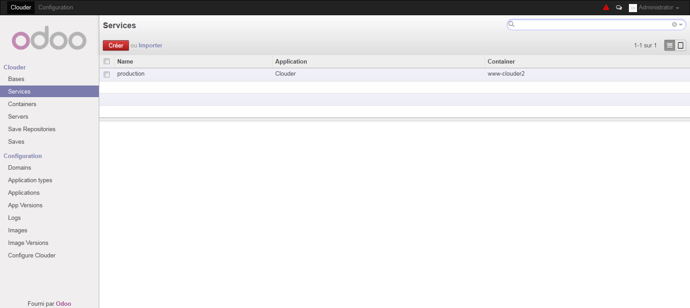
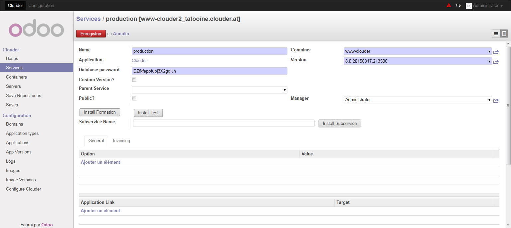
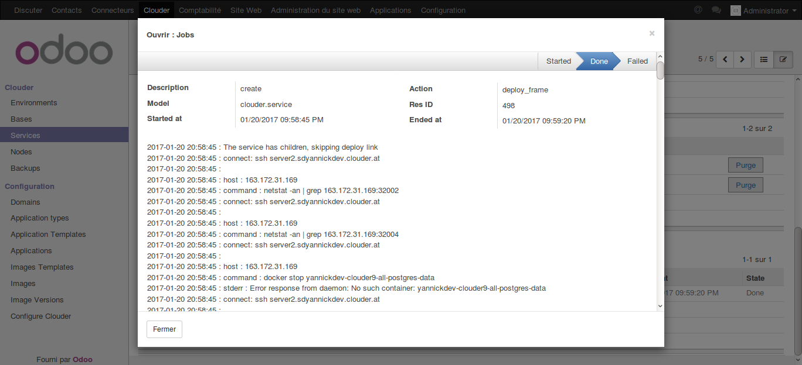

========
Services
========

A service is an installation of an application inside a container. For some applications, like Odoo or Drupal, you can have several services inside the same container.
This is useful if you want to give an ssh access of a container to a customer, and have the production and development/test services inside the same container.

To create a new service on one of your containers, you just have to add it in the Services menu and it will be automatically deployed.

The important fields are :
- The service name. You can only use here lowercase, digit and hyphen.

- The container where the service will be install, this will automatically fill the application.

- The application version to use, to know which archive shall be used.

- The database password. If the application use a database, a new database user will be created along with the service and you have to define his password. A password is automatically generated but you can use one of yours.

- If you use a custom version of the files. If yes, the files inside the archive will be copied inside the container, if no and if the symlink is allowed in the application type, a symlink will be created.
Check with caution, this may strongly increase the container backups size.

-Check the public checkbox if you want all users of the Clouder to be able to use this service. Otherwise, a user can only access a service if he is the manager of this service (or an administrator).

You can specify a parent service. This link is interesting to easily deploy files from the development service to the production service, if you click on the Deploy to parent button it will automatically (after a container backup) delete the production files, replace them with the files from child service and trigger an update on all the bases linked to the parent service.

You can also easily create a subservice by indicating the name of the subservice and clicking on Install subservice. This will create the subservice with the same files, link it to the current service, and duplicate all the base linked to the current service. Use Install test and Install formation to install these subservices.

See the `Applications <applications.rst>`_ chapter for more informations about options and links. Note that a link to a database container is often required.

When you save the new service :
- If needed, the files will be copied from the archive to the host system and will be copied inside the container.
- A database user will be created.
- The commands post creation will finish to configure the service
- The links will be deployed.

You can check all the executed commands in the log.

If something went wrong, you can use the reinstall button to purge and reinstall the service.